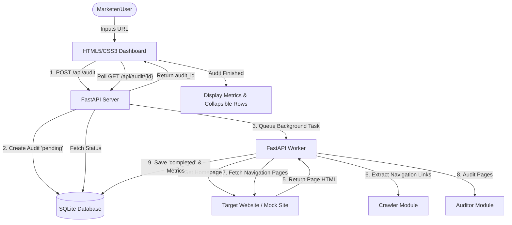

# Technical SEO Auditing Hub

A Dockerized Technical SEO Auditing application built for Zensor Solutions. This tool accepts a target website, identifies its primary navigation links, crawls each page within the navigation scope, audits them against technical SEO signals (HTTP status, title length, meta description length, headings count, canonical presence, and indexability), and presents results in a premium interactive dashboard.

## Features & Sandbox Environment

- **Navigation-Specific Crawler:** Extracts internal links strictly from primary menus, filtering out sidebars, footers, and content body links.
- **Detailed SEO Diagnostics:** Inspects status codes, title/meta description length ranges, H1 heading violations, canonical declarations, indexability meta tags/compliance headers, and page payload size.
- **Actionable Repairs:** Generates human-friendly checkmarks and correction lists detailing exactly how developers can fix flagged issues.
- **Embedded Test Site Sandbox:** Includes a built-in mock web suite serving pages pre-seeded with SEO errors. This enables immediate local validation of every diagnostic rule without relying on external websites.

---

## How to Run the Project

The solution is containerized and requires no local package installations. Choose one of the options below:

### Option A: Using Docker Compose (Recommended)

1. Open your terminal in the project root directory.
2. Spin up the container:
   ```bash
   docker compose up --build
   ```
3. Open your browser and navigate to:
   ```
   http://localhost:8000/
   ```

### Option B: Using Plain Docker Commands

1. Build the Docker image:
   ```bash
   docker build -t zensor-seo-auditor .
   ```
2. Run the image exposing port 8000:
   ```bash
   docker run -p 8000:8000 -v "%cd%/data:/app/data" zensor-seo-auditor
   ```
   *(Note: Use `$(pwd)/data` instead of `%cd%/data` on macOS/Linux environments).*
3. Open your browser and navigate to:
   ```
   http://localhost:8000/
   ```

---

## How Navigation Links Are Detected

To fulfill the **Navigation-Based Crawling** requirement (focusing on headers/menus and ignoring footer, sidebar, and body links), the system utilizes BeautifulSoup heuristics:

1. **Semantic Container Search:** The crawler first queries the DOM for semantic HTML5 `<nav>` elements, followed by any elements containing the accessibility attribute `role="navigation"`.
2. **Class & ID Keyword Parsing:** If semantic markers are absent, the crawler scans standard wrapper elements (`<div>`, `<ul>`, `<ol>`, `<header>`) for IDs or classes containing navigation identifiers (e.g., `navbar`, `nav`, `menu-bar`, `main-menu`, `primary-menu`, `top-menu`). 
3. **Exclusion Rules:** Containers featuring classes or IDs associated with noise elements (e.g., `footer`, `sidebar`, `aside`, `widget`, `social`, `mobile-menu`) are explicitly ignored.
4. **Link Extraction & Normalization:**
   - Within matched containers, all `<a>` tags with valid `href` attributes are gathered.
   - Anchor tags (starting with `#`), javascript statements (`javascript:`), and contact protocols (`mailto:`, `tel:`) are discarded.
   - Relative links (e.g., `/pricing`) are resolved into absolute URLs using the homepage host.
   - URLs are normalized (stripping fragment queries and trailing slashes) to avoid double auditing.
   - Only same-domain or same-subdomain links are permitted; external URLs are ignored.
5. **Deduplication:** A unique URL list is assembled and audited. In the event that no navigation container matches, the crawler defaults to scanning page links while filtering out elements parented by standard footer/sidebar wrappers.

---

## Architecture Overview



### Backend (Python + FastAPI)
- **`main.py`:** Handles API routing, database setups, and dispatches long-running audit crawlers to the threadpool.
- **`crawler.py`:** Standardized fetching client using async `httpx` to handle redirects, timeouts, and headers, combined with BeautifulSoup to extract navigation menus.
- **`auditor.py`:** Standard library checks matching the core SEO rule checklist, outputting list codes and calculating summaries.
- **`database.py`:** Zero-dependency SQLite manager utilizing Python's built-in `sqlite3` to store job status and serialized JSON reports.

### Frontend (Vanilla HTML5 / CSS3 / ES6)
- **`index.html`:** Responsive UI dashboard structured into configuration forms, active states (landing, loading, errors), and reports.
- **`styles.css`:** Tailored CSS using variables, custom animations for status loaders, hover micro-interactions, metrics grids, and layout cards.
- **`app.js`:** Pure Javascript client coordinating POST actions, progress polling timers, DOM injection routines, and issue-to-remedy mapping.

---

## Trade-offs & Limitations

1. **SQLite Database Concurrency:** SQLite is lightweight and runs inside the container without external infrastructure. For production setups with high concurrency, SQLite write-locks during concurrent database writes could cause exceptions.
2. **Memory Page Size Auditing:** The crawler measures payload size by loading page responses fully into memory. If page payloads exceed hundreds of megabytes, memory exhaustion could happen.
3. **Synchronous Single-Thread Crawl Loops:** Pages extracted from navigation links are requested sequentially with a small delay (`0.4s`) to respect target sites. While polite, this throttles audit durations. 
4. **SPA / JavaScript Navigation Menus:** The crawler parses static HTML markup. Modern React/Angular/Vue web pages generating navigation links dynamically via client-side JavaScript will appear empty to this crawler.

---

## How to Evolve this into a Production SEO Crawler

To scale this project into a high-throughput, enterprise-ready SEO auditing service, we would implement:

1. **Distributed Queue System:** Migrating background workers out of FastAPI and onto a distributed task queue (like **Celery** or **Argo Workflows**) backed by **Redis** or **RabbitMQ** to scale auditing capacity independently.
2. **Headless Browser Rendering:** Integrating a rendering microservice (such as **Puppeteer**, **Playwright**, or **Splash**) to load, execute Javascript, and audit modern Single Page Applications (SPAs).
3. **Database Migration:** Swapping SQLite for a managed database (like **PostgreSQL** or **MongoDB**), allowing scalable reads, structured logging, and robust indexing.
4. **Asynchronous Concurrent Crawling:** Implementing an asynchronous crawler with token-bucket rate limiters per target host, respecting `robots.txt` directives while maximizing scraping throughput.
5. **Graph Architecture Storage:** Storing linking relationships in a graph database (like **Neo4j**) to allow path analysis, page rank calculations, and orphan-page discovery.
